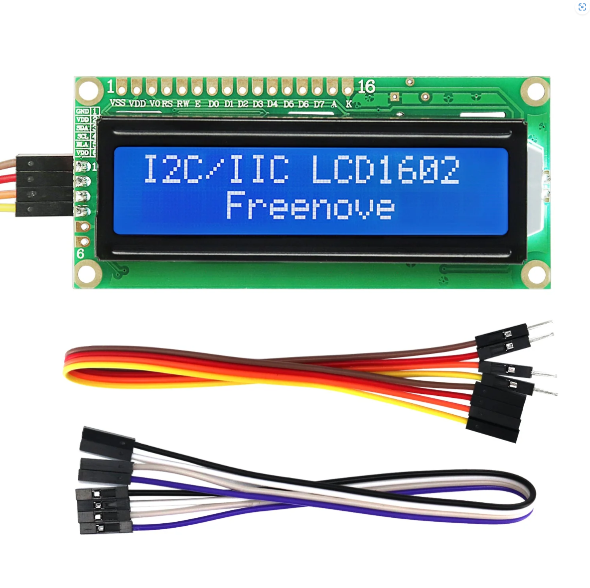

.. list-table:: 
   :header-rows: 1 
   :width: 76%
   :align: left
   
   * -  Image
     -  SKU
     -  Name

   * -  |FNK0079|
     -  :Freenove:`FNK0079 <fnk0058>`
     -  Freenove Breakout Board for Arduino Nano 
      
        Micro Raspberry Pi Pico 1 2 W ESP32 ESP8266
       

   * -  |FNK0101|
     -  :Freenove:`FNK0101 <fnk0101>`
     -  Freenove I2C IIC LCD 1602 2004 Module

.. |FNK0101| image:: ../_static/products/Components/FNK0101.png     