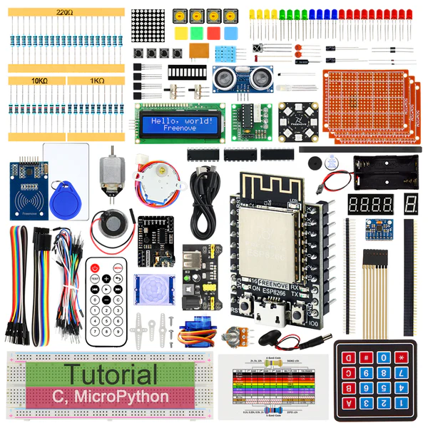
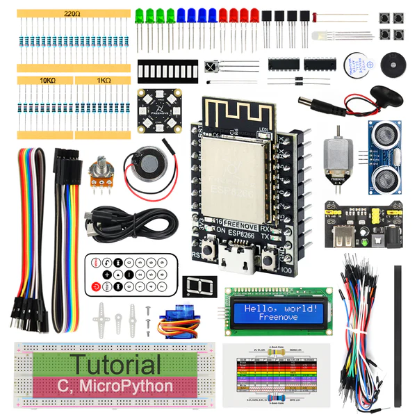
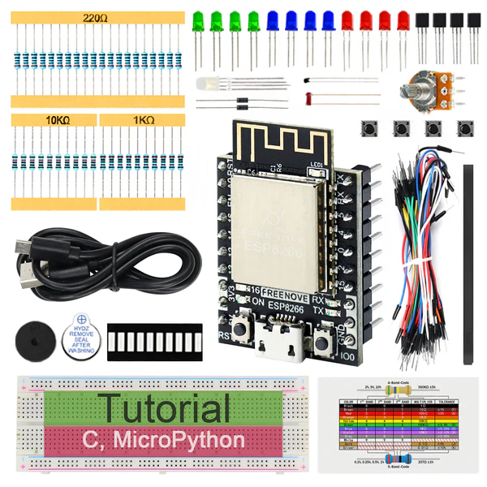
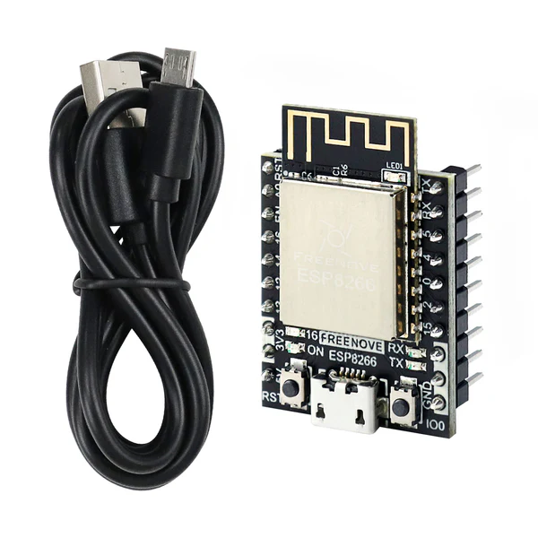

Starter kits
----------------------------------------------------------------

.. list-table:: 
   :header-rows: 1 
   :width: 71%
   :align: left
   
   * -  Image
     -  SKU
     -  Name

   * -  |FNK0073|
     -  :Freenove:`FNK0073 <fnk0073>`
     -  Freenove Ultimate Starter Kit for ESP8266

   * -  |FNK0074|
     -  :Freenove:`FNK0074 <fnk0074>`
     -  Freenove Super Starter Kit for ESP8266

   * -  |FNK0075|
     -  :Freenove:`FNK0075 <fnk0075>`
     -  Freenove Basic Starter Kit for ESP8266

   * -  |FNK0076|
     -  :Freenove:`FNK0076 <fnk0076>`
     -  Freenove ESP8266 Board
  

Robotics kits
----------------------------------------------------------------

.. .. list-table:: 
..    :header-rows: 1 
..    :align: center
   
..    * -  Image
..      -  SKU
..      -  Name

..    * -  |FNK0030.MAIN|
..      -  fnk0030
..      -  Freenove Quadruped Robot Kit with Remote (Compatible with Arduino IDE)

..    * -  |FNK0031.MAIN|
..      -  fnk0031
..      -  Freenove Hexapod Robot Kit with Remote (Compatible with Arduino IDE)

..    * -  |FNK0041.MAIN|
..      -  fnk0041
..      -  Freenove 4WD Car Kit (Compatible with Arduino IDE)

..    * -  |FNK0042.MAIN|
..      -  fnk0042
..      -  Freenove Robot Ant Kit (Compatible with Arduino IDE)

.. .. |FNK0030.MAIN| image:: ../_static/products/Arduino/FNK0030.MAIN.jpg
.. .. |FNK0031.MAIN| image:: ../_static/products/Arduino/FNK0031.MAIN.jpg
.. .. |FNK0041.MAIN| image:: ../_static/products/Arduino/FNK0041B.MAIN.jpg    
.. .. |FNK0042.MAIN| image:: ../_static/products/Arduino/FNK0042.MAIN.jpg