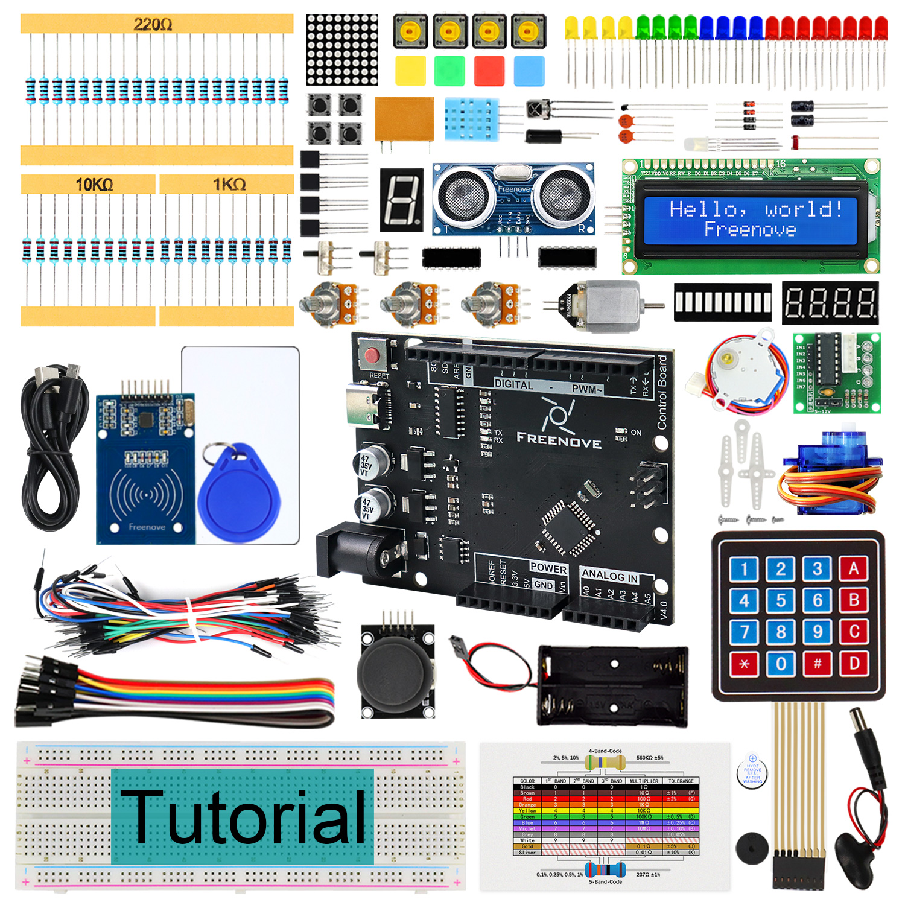
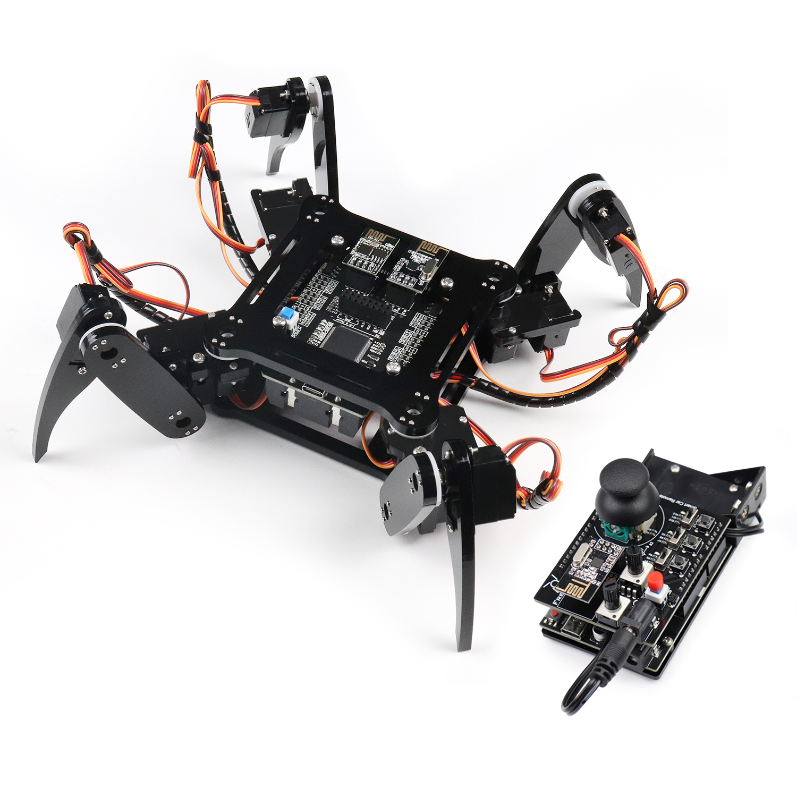
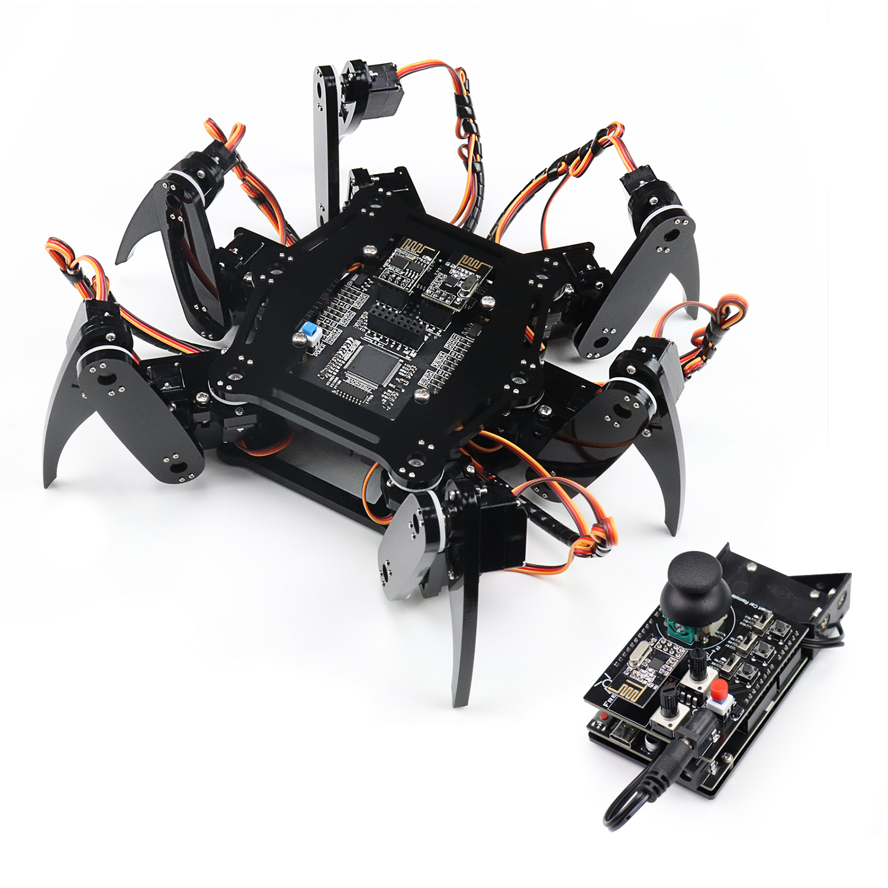
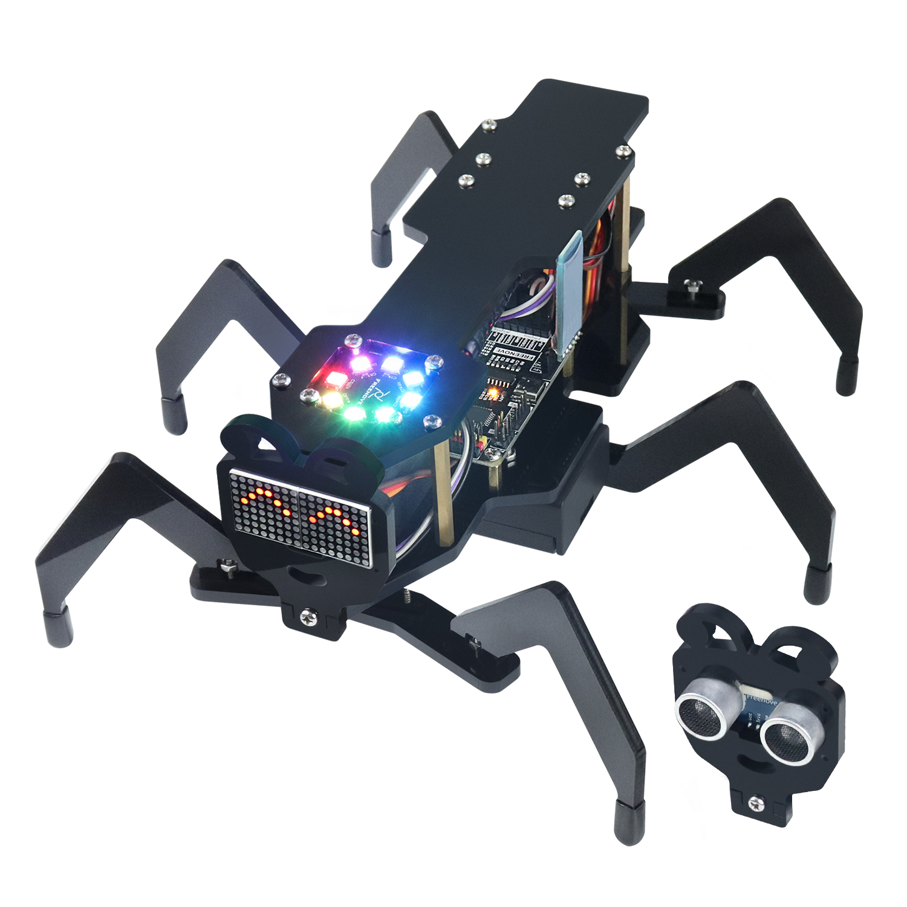

Starter kits
----------------------------------------------------------------

.. list-table:: 
   :header-rows: 1 
   :width: 89%
   :align: left
   
   * -  Image
     -  SKU
     -  Name

   * -  |FNK0017.MAIN|
     -  :Freenove:`FNK0017 <fnk0017>`
     -  Freenove Ultimate Starter Kit (Compatible with Arduino IDE)

   * -  |FNK0034.MAIN|
     -  :Freenove:`FNK0034 <fnk0034>`
     -  Freenove RFID Starter Kit V2.0 (Compatible with Arduino IDE)

   * -  |FNK0059.MAIN|
     -  :Freenove:`FNK0059 <fnk0059>`
     -  Freenove Projects Kit (Compatible with Arduino IDE)

.. |FNK0017.MAIN| image:: ../_static/products/Arduino/FNK0017E.MAIN.jpg    

.. |FNK0059.MAIN| image:: ../_static/products/Arduino/FNK0059A.MAIN.jpg    

Robotics kits
----------------------------------------------------------------

.. list-table:: 
   :header-rows: 1 
   :width: 73%
   :align: left
   
   * -  Image
     -  SKU
     -  Name

   * -  |FNK0030.MAIN|
     -  FNK0030
     -  Freenove Quadruped Robot Kit with Remote 
      
        (Compatible with Arduino IDE)

   * -  |FNK0031.MAIN|
     -  FNK0031
     -  Freenove Hexapod Robot Kit with Remote 
      
        (Compatible with Arduino IDE)

   * -  |FNK0041.MAIN|
     -  FNK0041
     -  Freenove 4WD Car Kit 
      
        (Compatible with Arduino IDE)

   * -  |FNK0042.MAIN|
     -  FNK0042
     -  Freenove Robot Ant Kit 
      
        (Compatible with Arduino IDE)

.. |FNK0041.MAIN| image:: ../_static/products/Arduino/FNK0041B.MAIN.jpg    
