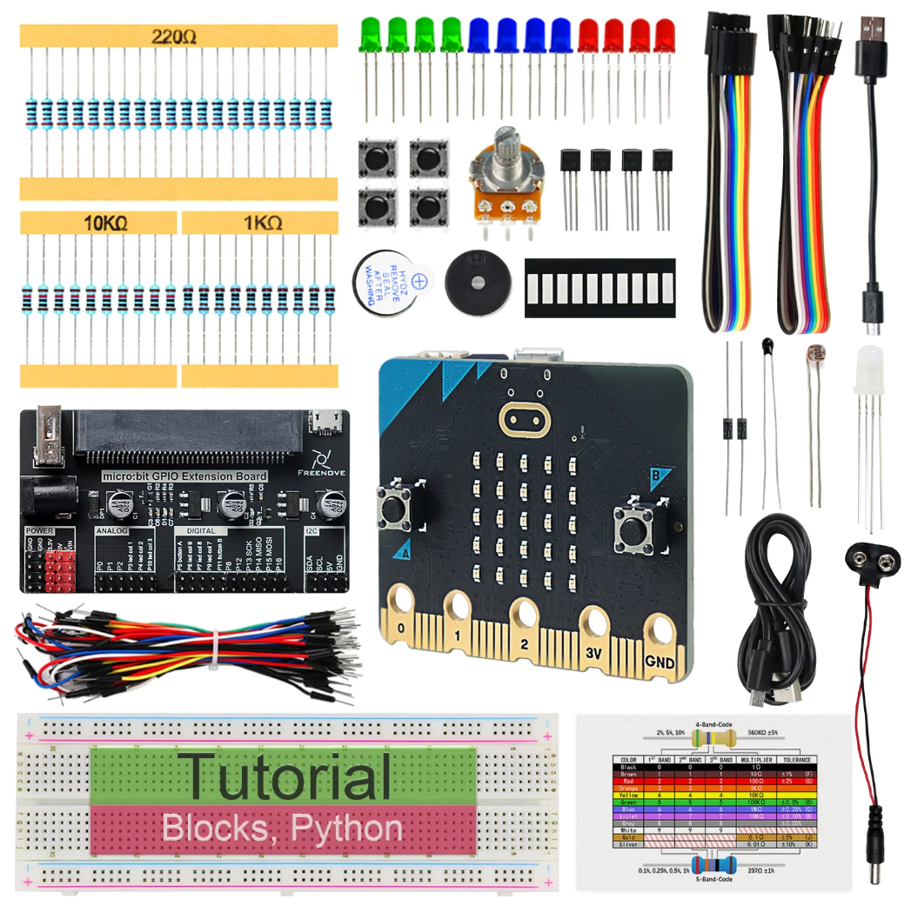

Starter kits
----------------------------------------------------------------

.. list-table:: 
   :header-rows: 1 
   :width: 78.5%
   :align: left
   
   * -  Image
     -  SKU
     -  Name

   * -  |FNK0045|
     -  :Freenove:`FNK0045 <fnk0045>`
     -  Freenove Ultimate Starter Kit for BBC micro:bit V2

   * -  |FNK0070|
     -  :Freenove:`FNK0070 <fnk0070>`
     -  Freenove BBC micro:bit V2 Board

   * -  |FNK0071|
     -  :Freenove:`FNK0071 <fnk0071>`
     -  Freenove Super Starter Kit for BBC micro:bit V2

   * -  |FNK0072|
     -  :Freenove:`FNK0072 <fnk0072>`
     -  Freenove Basic Starter Kit for BBC micro:bit V2

.. |FNK0045| image:: ../_static/products/micro_bit/FNK0045.png    
.. |FNK0070| image:: ../_static/products/micro_bit/FNK0070.png  
.. |FNK0071| image:: ../_static/products/micro_bit/FNK0071.png      

Robotics kits
----------------------------------------------------------------

.. list-table:: 
   :header-rows: 1 
   :width: 75%
   
   * -  Image
     -  SKU
     -  Name

   * -  |FNK0037|
     -  :Freenove:`FNK0037 <fnk0037>`
     -  Freenove Micro:Rover Kit for BBC micro:bit V2

.. |FNK0037| image:: ../_static/products/micro_bit/FNK0037.png