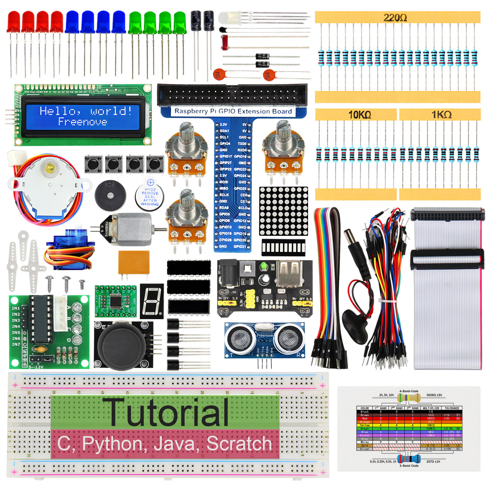
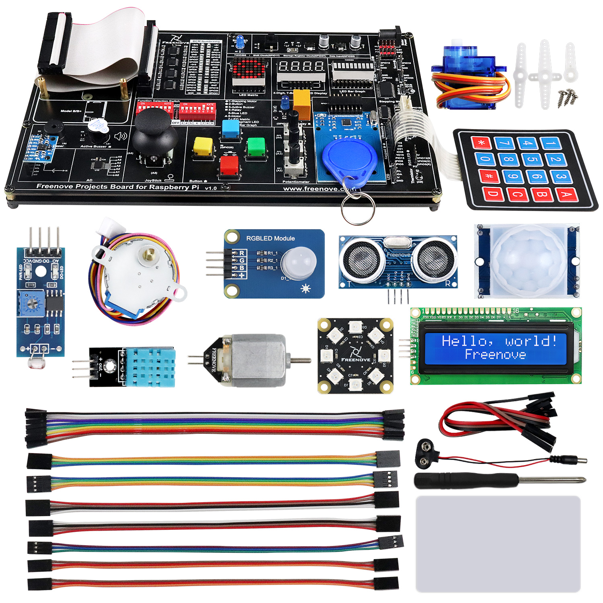
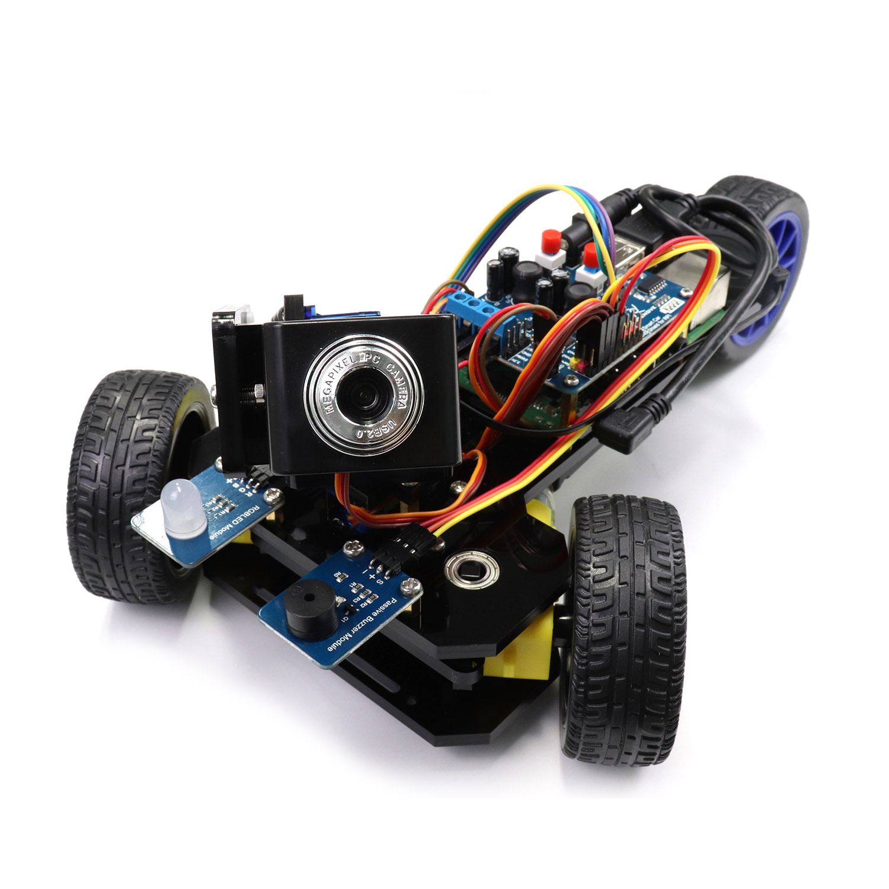
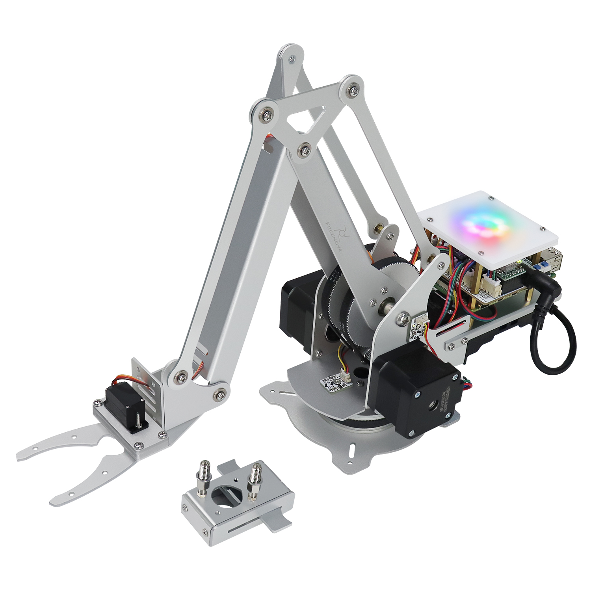

Starter kits
----------------------------------------------------------------

.. list-table:: 
   :header-rows: 1 
   :width: 75%
   :align: left
   
   * -  Image
     -  SKU
     -  Name

   * -  |FNK0019.MAIN|
     -  :Freenove:`FNK0019 <fnk0019>`
     -  Freenove Super Starter Kit for Raspberry Pi

   * -  |FNK0020.MAIN|
     -  :Freenove:`FNK0020 <fnk0020>`
     -  Freenove Ultimate Starter Kit for Raspberry Pi

   * -  |FNK0022.MAIN|
     -  :Freenove:`FNK0022 <fnk0022>`
     -  Freenove Basic Starter Kit for Raspberry Pi

   * -  |FNK0023.MAIN|
     -  :Freenove:`FNK0023 <fnk0023>`
     -  Freenove LCD1602 Starter Kit for Raspberry Pi

   * -  |FNK0024.MAIN|
     -  :Freenove:`FNK0024 <fnk0024>`  
     -  Freenove Ultrasonic Starter Kit for Raspberry Pi

   * -  |FNK0025.MAIN|
     -  :Freenove:`FNK0025 <fnk0025>` 
     -  Freenove RFID Starter Kit for Raspberry Pi

   * -  |FNK0066.MAIN|
     -  :Freenove:`FNK0066 <fnk0066>`
     -  Freenove Complete Starter Kit for Raspberry Pi
  
   * -  |FNK0054.MAIN|
     -  :Freenove:`FNK0054 <fnk0054>`
     -  Freenove Projects Kit for Raspberry Pi

.. |FNK0019.MAIN| image:: ../_static/products/RaspberryPi/FNK0019.MAIN.jpg    
.. |FNK0020.MAIN| image:: ../_static/products/RaspberryPi/FNK0020.MAIN.jpg    
.. |FNK0022.MAIN| image:: ../_static/products/RaspberryPi/FNK0022.MAIN.jpg    
.. |FNK0023.MAIN| image:: ../_static/products/RaspberryPi/FNK0023.MAIN.jpg    

.. |FNK0025.MAIN| image:: ../_static/products/RaspberryPi/FNK0025.MAIN.jpg    
.. |FNK0066.MAIN| image:: ../_static/products/RaspberryPi/FNK0066.MAIN.jpg    

Robotics kits
----------------------------------------------------------------

.. list-table:: 
   :header-rows: 1 
   :width: 84%
   :align: left
   
   * -  Image
     -  SKU
     -  Name

   * -  |FNK0021.MAIN|
     -  FNK0021
     -  Freenove Three-wheeled Smart Car Kit for Raspberry Pi

   * -  |FNK0036.MAIN|
     -  FNK0036
     -  Freenove Robot Arm Kit for Raspberry Pi

   * -  |FNK0043.MAIN|
     -  :Freenove:`FNK0043 <fnk0043>` 
     -  Freenove 4WD Smart Car Kit for Raspberry Pi

   * -  |FNK0043B.MAIN| 
     -  FNK0043B
     -  Freenove 4MWD Smart Car Kit for Raspberry Pi

   * -  |FNK0050.MAIN|
     -  :Freenove:`FNK0050 <fnk0050>`   
     -  Freenove Robot Dog Kit for Raspberry Pi

   * -  |FNK0052.MAIN|
     -  :Freenove:`FNK0052 <fnk0052>`   
     -  Freenove Big Hexapod Robot Kit for Raspberry Pi

   * -  |FNK0077.MAIN|
     -  FNK0077
     -  Freenove Tank Robot Kit for Raspberry Pi

.. |FNK0043.MAIN| image:: ../_static/products/RaspberryPi/FNK0043.MAIN.jpg    
.. |FNK0043B.MAIN| image:: ../_static/products/RaspberryPi/FNK0043B.MAIN.jpg    
.. |FNK0050.MAIN| image:: ../_static/products/RaspberryPi/FNK0050.MAIN.jpg    
.. |FNK0052.MAIN| image:: ../_static/products/RaspberryPi/FNK0052.MAIN.jpg    
.. |FNK0077.MAIN| image:: ../_static/products/RaspberryPi/FNK0077.MAIN.jpg    