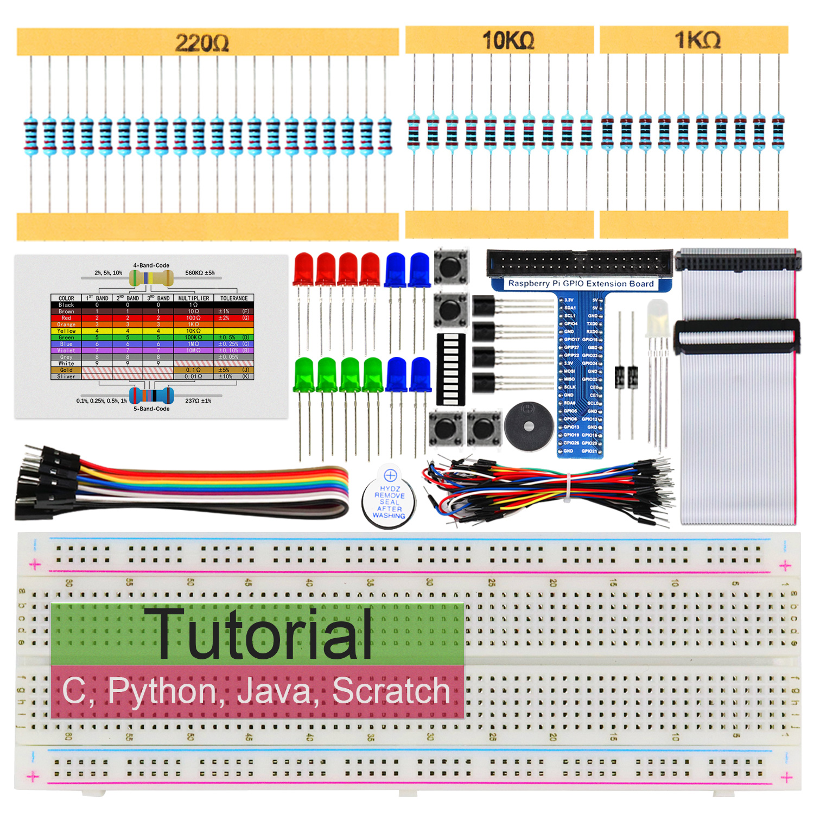

Starter kits
----------------------------------------------------------------

.. table:: Starter kit
    :width: 100%
    :class: product-table

    ====================================    ===================================================================================================     ==============================================================================
    Image                                   SKU                                                                                                     Name
    ====================================    ===================================================================================================     ==============================================================================
    |FNK0019.MAIN|                          `FNK0019 <https://freenove-docs2.readthedocs.io/projects/fnk0019/en/latest/fnk0019/fnk0019.html>`_      Freenove Super Starter Kit for Raspberry Pi
    |FNK0020.MAIN|                          `FNK0020 <https://freenove-docs2.readthedocs.io/projects/fnk0020/en/latest/fnk0020/fnk0020.html>`_      Freenove Ultimate Starter Kit for Raspberry Pi
    |FNK0022.MAIN|                          `FNK0022 <https://freenove-docs2.readthedocs.io/projects/fnk0022/en/latest/fnk0022/fnk0022.html>`_      Freenove Basic Starter Kit for Raspberry Pi
    |FNK0023.MAIN|                          `FNK0023 <https://freenove-docs2.readthedocs.io/projects/fnk0023/en/latest/fnk0023/fnk0023.html>`_      Freenove LCD1602 Starter Kit for Raspberry Pi
    |FNK0024.MAIN|                          `FNK0024 <https://freenove-docs2.readthedocs.io/projects/fnk0024/en/latest/fnk0024/fnk0024.html>`_      Freenove Ultrasonic Starter Kit for Raspberry Pi
    |FNK0025.MAIN|                          `FNK0025 <https://freenove-docs2.readthedocs.io/projects/fnk0025/en/latest/fnk0025/fnk0025.html>`_      Freenove RFID Starter Kit for Raspberry Pi
    |FNK0066.MAIN|                          `FNK0066 <https://freenove-docs2.readthedocs.io/projects/fnk0066/en/latest/fnk0066/fnk0066.html>`_      Freenove Complete Starter Kit for Raspberry Pi
    ====================================    ===================================================================================================     ==============================================================================

.. |FNK0019.MAIN| image:: ../_static/products/FNK0019.MAIN.jpg    
    :class: product-image
.. |FNK0020.MAIN| image:: ../_static/products/FNK0020.MAIN.jpg    
    :class: product-image

.. |FNK0023.MAIN| image:: ../_static/products/FNK0023.MAIN.jpg    
    :class: product-image
.. |FNK0024.MAIN| image:: ../_static/products/FNK0024.MAIN.jpg    
    :class: product-image
.. |FNK0025.MAIN| image:: ../_static/products/FNK0025.MAIN.jpg    
    
    :class: product-image
.. |FNK0066.MAIN| image:: ../_static/products/FNK0066.MAIN.jpg    
    :class: product-image

Robotics kits
----------------------------------------------------------------
.. table:: Robotics kit
    :width: 100%
    :class: product-table

    ====================================    =======================================================================================================     ==============================================================================
    Image                                   SKU                                                                                                         Name
    ====================================    =======================================================================================================     ==============================================================================
    |FNK0021.MAIN|                          `FNK0021 <https://freenove-docs2.readthedocs.io/projects/fnk0021/en/latest/fnk0021/fnk0021.html>`_          Freenove Three-wheeled Smart Car Kit for Raspberry Pi
    |FNK0036.MAIN|                          `FNK0036 <https://freenove-docs2.readthedocs.io/projects/fnk0036/en/latest/fnk0036/fnk0036.html>`_          Freenove Robot Arm Kit for Raspberry Pi
    |FNK0043.MAIN|                          `FNK0043 <https://freenove-docs2.readthedocs.io/projects/fnk0043/en/latest/fnk0043/fnk0043.html>`_          Freenove 4WD Smart Car Kit for Raspberry Pi
    |FNK0043B.MAIN|                         `FNK0043B <https://freenove-docs2.readthedocs.io/projects/fnk0043B/en/latest/fnk0043B/fnk0043B.html>`_      Freenove 4MWD Smart Car Kit for Raspberry Pi
    |FNK0050.MAIN|                          `FNK0050 <https://freenove-docs2.readthedocs.io/projects/fnk0050/en/latest/fnk0050/fnk0050.html>`_          Freenove Robot Dog Kit for Raspberry Pi
    |FNK0052.MAIN|                          `FNK0052 <https://freenove-docs2.readthedocs.io/projects/fnk0052/en/latest/fnk0052/fnk0052.html>`_          Freenove Big Hexapod Robot Kit for Raspberry Pi
    |FNK0077.MAIN|                          `FNK0066 <https://freenove-docs2.readthedocs.io/projects/FNK0077/en/latest/fnk0077/fnk0077.html>`_          Freenove Tank Robot Kit for Raspberry Pi
    ====================================    =======================================================================================================     ==============================================================================

.. |FNK0021.MAIN| image:: ../_static/products/FNK0021.MAIN.jpg
    :class: product-image
.. |FNK0036.MAIN| image:: ../_static/products/FNK0036.MAIN.jpg
    :class: product-image
.. |FNK0043.MAIN| image:: ../_static/products/FNK0043.MAIN.jpg    
    :class: product-image
.. |FNK0043B.MAIN| image:: ../_static/products/FNK0043B.MAIN.jpg    
    :class: product-image
.. |FNK0050.MAIN| image:: ../_static/products/FNK0050.MAIN.jpg    
    :class: product-image
.. |FNK0052.MAIN| image:: ../_static/products/FNK0052.MAIN.jpg    
    :class: product-image
.. |FNK0077.MAIN| image:: ../_static/products/FNK0077.MAIN.jpg    
    :class: product-image

